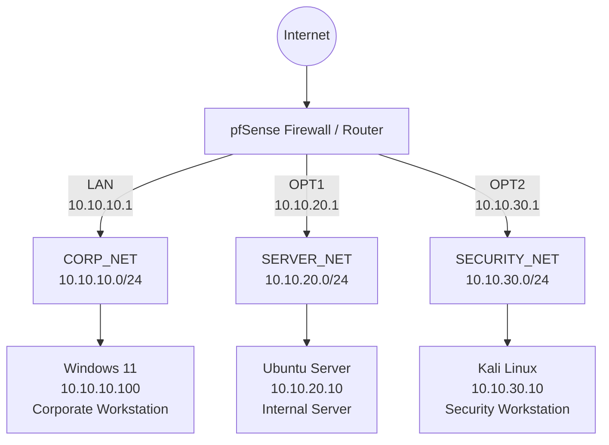

# Enterprise Network Security Lab

## Overview

This project is a virtual enterprise-style network security lab built in Oracle VirtualBox to practice network segmentation, firewall policy design, least-privilege access control, Linux and Windows administration, and security validation.

The environment uses **pfSense as the central router and firewall** to separate three internal networks:

- **CORP_NET** - Windows corporate workstation
- **SERVER_NET** - Ubuntu Server
- **SECURITY_NET** - Kali Linux security workstation

Firewall policies were designed to restrict unnecessary communication between network segments while permitting specific business and administrative services.

The environment was validated using connectivity testing, SSH, Nmap scanning, DNS testing, and pfSense firewall logs.

---

## Technologies Used

- Oracle VirtualBox
- pfSense Community Edition
- Windows 11
- Ubuntu Server
- Kali Linux
- Nmap
- SSH
- TCP/IP
- DNS
- NTP
- HTTP/HTTPS
- Stateful firewall rules
- Network segmentation

---

## Network Architecture

| Network | Subnet | pfSense Interface | Primary System |
|---|---|---|---|
| CORP_NET | `10.10.10.0/24` | LAN | Windows 11 |
| SERVER_NET | `10.10.20.0/24` | OPT1 | Ubuntu Server |
| SECURITY_NET | `10.10.30.0/24` | OPT2 | Kali Linux |

### Key Hosts

| System | IP Address | Role |
|---|---|---|
| pfSense LAN | `10.10.10.1` | CORP_NET gateway |
| Windows 11 | `10.10.10.100` | Corporate workstation |
| pfSense OPT1 | `10.10.20.1` | SERVER_NET gateway |
| Ubuntu Server | `10.10.20.10` | Internal server |
| pfSense OPT2 | `10.10.30.1` | SECURITY_NET gateway |
| Kali Linux | `10.10.30.10` | Security testing workstation |

## Architecture Diagram



---

## Security Design

The lab follows a **least-privilege** approach. Systems are not given unrestricted access between internal network segments.

### CORP_NET

The corporate workstation is permitted to use specifically authorized services on the server network while broader internal access is restricted.

For example:

- CORP_NET → Ubuntu SSH (`TCP/22`) — **Allowed**
- Unauthorized CORP_NET → internal traffic — **Blocked**

### SERVER_NET

The Ubuntu server is prevented from initiating connections into the corporate and security networks.

Outbound server access is restricted to required services:

- DNS — `TCP/UDP 53`
- HTTP — `TCP 80`
- HTTPS — `TCP 443`
- NTP — `UDP 123`

A temporary unrestricted SERVER_NET rule used during troubleshooting was removed after the required outbound services were identified and tested.

### SECURITY_NET

Kali Linux operates from a dedicated security network.

Specific permissions include:

- SECURITY_NET → Ubuntu SSH (`TCP/22`) — **Allowed**
- SECURITY_NET → pfSense ICMP Echo Request — **Allowed**
- SECURITY_NET → pfSense DNS (`TCP/UDP 53`) — **Allowed**
- SECURITY_NET → general internal networks — **Blocked**
- SECURITY_NET → Internet — **Allowed**

Because pfSense uses stateful filtering, response traffic for permitted connections is automatically allowed without creating unnecessary reverse-direction rules.

---

## Firewall Aliases

Aliases were used to simplify firewall administration and make policies easier to understand.

Examples include:

### INTERNAL_NETWORKS

- `10.10.10.0/24`
- `10.10.20.0/24`
- `10.10.30.0/24`

### PUBLIC_DNS

- `8.8.8.8`
- `1.1.1.1`

### WEB_PORTS

- `80`
- `443`

---

## Security Validation

Firewall behavior was validated from the Kali Linux security workstation.

### SERVER_NET Nmap Test

The Ubuntu server was tested with:

```bash
nmap -Pn -p 22,80,443,445,3389 10.10.20.10
```

Observed behavior:

| Port | Service | Result |
|---|---|---|
| 22/TCP | SSH | Open |
| 80/TCP | HTTP | Filtered |
| 443/TCP | HTTPS | Filtered |
| 445/TCP | SMB | Filtered |
| 3389/TCP | RDP | Filtered |

This demonstrated that the explicit SSH exception was reachable while other tested services were filtered by pfSense.

### CORP_NET Nmap Test

The Windows workstation was tested with:

```bash
nmap -Pn -p 135,139,445,3389 10.10.10.100
```

The tested Windows services were reported as **filtered**, confirming that SECURITY_NET did not have unrestricted access to CORP_NET.

---

## Firewall Log Validation

Logging was enabled on the SECURITY_NET internal-block rule.

A controlled Nmap probe from:

`10.10.30.10 → 10.10.10.100:445`

was reported as **filtered** by Nmap.

The corresponding pfSense firewall log showed the connection being blocked on **OPT2** by the configured:

`BLOCK - SEC_NET TO INTERNAL NETWORKS`

rule.

This provided validation from both the client and firewall perspectives.

---

## Troubleshooting

### Kali DNS Failure

Kali could successfully ping external IP addresses but could not resolve domain names.

Investigation showed that Kali was configured to use:

`10.10.30.1`

as its DNS server.

The firewall allowed ICMP traffic to pfSense but did not yet permit DNS traffic. A specific rule was added allowing:

`SECURITY_NET → 10.10.30.1 → TCP/UDP 53`

After applying the rule, domain-name resolution and Internet access by hostname succeeded.

### SERVER_NET Egress Hardening

During initial configuration, SERVER_NET used a temporary broad outbound rule for testing.

Instead of leaving unrestricted outbound access in the final configuration, required server services were identified and replaced with specific rules for:

- DNS
- HTTP
- HTTPS
- NTP

The temporary rule was disabled and the replacement rules were tested individually.

Validation included:

```bash
resolvectl query google.com
```

for DNS,

```bash
curl -I https://google.com
```

for HTTPS, and:

```bash
timedatectl timesync-status
```

for NTP synchronization.

After all required services worked successfully, the temporary broad rule was permanently deleted.

---

## Key Outcomes

This project demonstrates practical experience with:

- Designing segmented IPv4 networks
- Configuring pfSense routing and firewall policies
- Applying least-privilege network access
- Creating reusable firewall aliases
- Understanding stateful packet filtering
- Configuring static addressing and gateways
- Restricting server egress traffic
- Using SSH for secure remote administration
- Performing authorized network validation with Nmap
- Interpreting open versus filtered ports
- Analyzing firewall logs
- Troubleshooting DNS and connectivity issues
- Validating security controls instead of assuming they work

---

## Project Status

**Core network infrastructure:** Complete  
**Network segmentation:** Complete  
**Firewall policy implementation:** Complete  
**Security validation:** Complete  
**Documentation:** In progress
